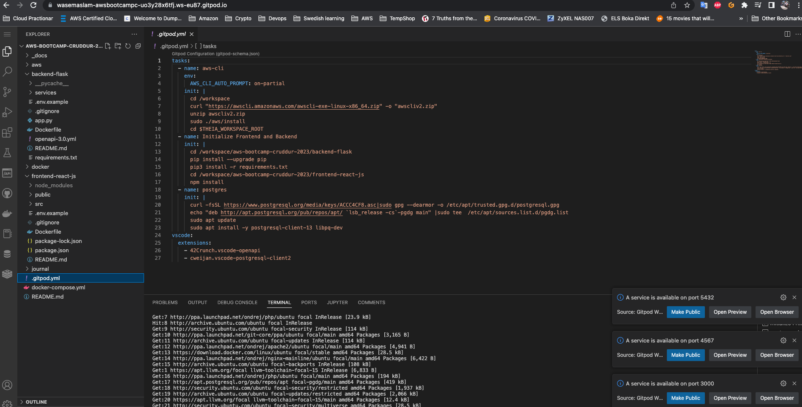
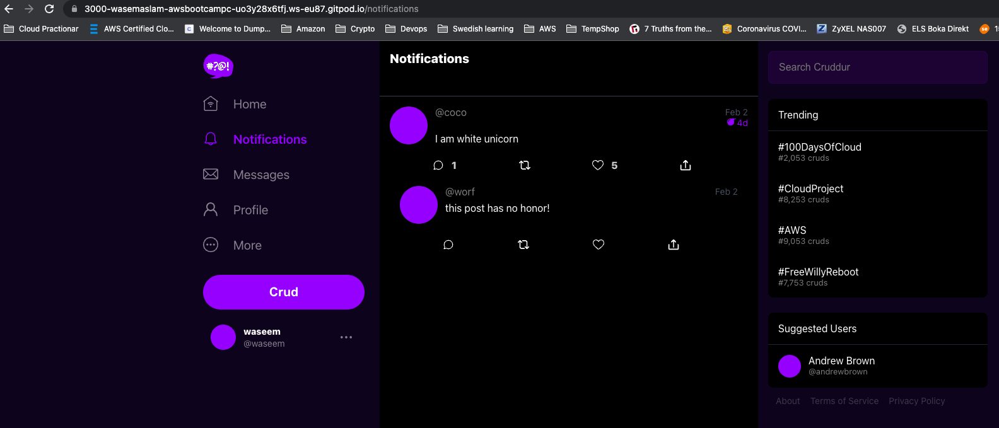

# Week 1 — App Containerization

## Technical Task
```
✅ Create a new GitHub repo
✅ Launch the repo within a Gitpod workspace
✅ Configure Gitpod.yml configuration, eg. VSCode Extensions
✅ Clone the frontend and backend repo
✅ Explore the codebases
✅ Ensure we can get the apps running locally
✅ Write a Dockerfile for each app
✅ Ensure we get the apps running via individual container
✅ Create a docker-compose file
✅ Ensure we can orchestrate multiple containers to run side by side
✅ Mount directories so we can make changes while we code
```
## Homework Challenges    

```
✅ Run the dockerfile CMD as an external script
✅ Push and tag a image to DockerHub (they have a free tier)
✅ Use multi-stage building for a Dockerfile build
✅ Implement a healthcheck in the V3 Docker compose file
✅ Research best practices of Dockerfiles and attempt to implement it in your Dockerfile
✅ Learn how to install Docker on your localmachine and get the same containers running outside of Gitpod / Codespaces
✅ Launch an EC2 instance that has docker installed, and pull a container to demonstrate you can run your own docker processes. 
```

Week1 was tough as i never worked with docker before but i spend quite much time by watching all the homework videos and also watched live cloud job role video which will definately help me to decide where i want to work in cloud.By completing technical task and homework challange i got good understandong of how docker, images and container works.As i also pushed my image to dockerhub so now i understand the purpose of docker registry repository. 


## Technical Task

I have completed all the tasks mentioned above in 'Technical Task' and run individual containers using Andrew 
[Guideline](https://github.com/omenking/aws-bootcamp-cruddur-2023/blob/week-1/journal/week1.md)
All my code is committed in my Repo as a proof.


After completing individualrunning container app was working fine but i forgot to take screenshot. I also asked this question to Andrew in office hours and he said its ok.

After this step, wrote docker compose yml file where i also added enviromnets,network and ports.

Here is how compose file looks like and code is already in repo.


I also added npm install in gitpod.yml file so i dont need to do everytime.

Gitpod.yml screenshot.


Make sure to opened the ports.


Docker copmose container running now as showing in screenshot.


For DynamoDB local followed following [Guideline](https://github.com/100DaysOfCloud/challenge-dynamodb-local)

As table is created with items and showing table in screenshot.


PostgreSQL connected


Final cruddur GUI is showing running in compose container.


As I also aded Notification functionality so working fine.




## Homework Challenges 

✅ Run the dockerfile CMD as an external script

Cretaed app.py and Dockerfile in Visualstudio locally at my macbook.

Dockerfile

```
FROM python:3.8-alpine
COPY . /app
WORKDIR /app
CMD ["python","app.py"]
```

app.py
```
print("Hello World")
```

Run the command to build image
```
docker build -t helloworld .
```

At my local terminal at mac showing the program written helloword and dockerfile.


✅ Use multi-stage building for a Dockerfile build

I followed the following   
[Guideline](http://100daysofdevops.com/use-multi-stage-builds-with-dockerfile/) for multistage.

First wrote dokerfile as single stage as showing in screenshot and also wrote simple helloworld program in go lang langauge.


```
docker build -t single.stage .
```


```
docker build -t multi.stage .
```


