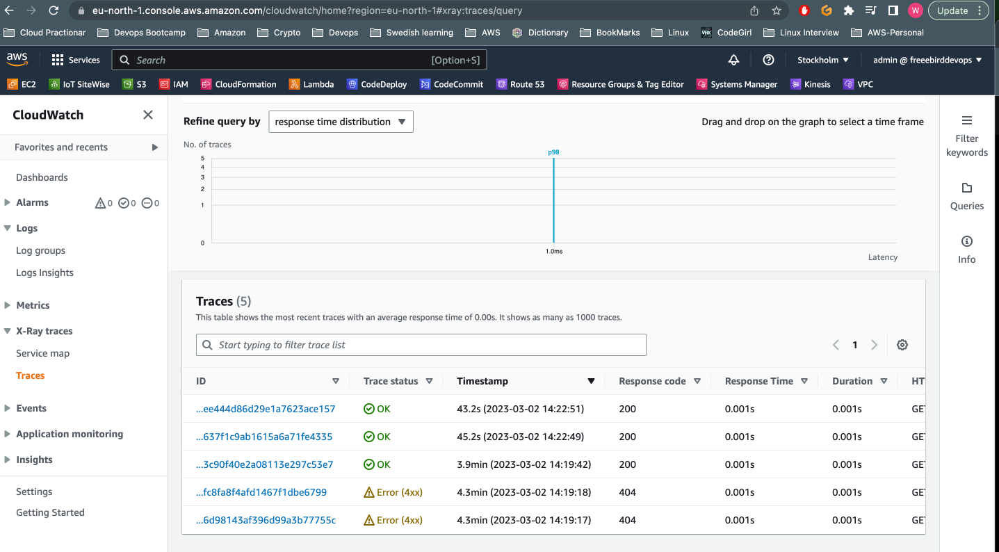

## Week 2 — Distributed Tracing


# Technical Tasks


✅ Instrument our backend flask application to use Open Telemetry (OTEL) with Honeycomb.io as the provider.

✅ Run queries to explore traces within Honeycomb.io

✅ Instrument AWS X-Ray into backend flask application

✅ Configure and provision X-Ray daemon within docker-compose and send data back to X-Ray API

✅ Observe X-Ray traces within the AWS Console

✅ Integrate Rollbar for Error Logging

✅ Trigger an error an observe an error with Rollbar

✅ Install WatchTower and write a custom logger to send application log data to - CloudWatch Log group
 
 
 #  Homework Challenges 
    
✅ Instrument Honeycomb for the frontend-application to observe network latency between frontend and backend[HARD]

✅ Add custom instrumentation to Honeycomb to add more attributes eg. UserId, Add a custom span

✅ Run custom queries in Honeycomb and save them later eg. Latency by UserID, Recent Traces

###########################################################################################################################################################

✅ Instrument our backend flask application to use Open Telemetry (OTEL) with Honeycomb.io as the provider.


✅ Run queries to explore traces within Honeycomb.io


✅ Instrument AWS X-Ray into backend flask application

I followed Andrew [Guideline](https://github.com/omenking/aws-bootcamp-cruddur-2023/blob/week-2/journal/week2.md) 


Instrument AWS X-Ray for Flask

```
export AWS_REGION="eu-north-1"
gp env AWS_REGION="eu-north-1"
```
Added xray sdk in requirements.txt

``` 
pip install -r requirements.txt

```


Installed python dependencies 
```
pip install -r requirements.txt
```

Updated app.py with following code.

```
from aws_xray_sdk.core import xray_recorder
from aws_xray_sdk.ext.flask.middleware import XRayMiddleware

xray_url = os.getenv("AWS_XRAY_URL")
xray_recorder.configure(service='Cruddur', dynamic_naming=xray_url)
XRayMiddleware(app, xray_recorder)

```
Configured AWS X-Ray Resources.
Add ```aws/json/xray.json```

```
{
  "SamplingRule": {
      "RuleName": "Cruddur",
      "ResourceARN": "*",
      "Priority": 9000,
      "FixedRate": 0.1,
      "ReservoirSize": 5,
      "ServiceName": "Cruddur",
      "ServiceType": "*",
      "Host": "*",
      "HTTPMethod": "*",
      "URLPath": "*",
      "Version": 1
  }
}
```

Here its showing installed requirements and also xray.json added.


Cretaed group using aws command.


AWS console showing ```Cruddur``` group is created.


Added X-ray daemon to docker service in Docker compose file.

```
 xray-daemon:
    image: "amazon/aws-xray-daemon"
    environment:
      AWS_ACCESS_KEY_ID: "${AWS_ACCESS_KEY_ID}"
      AWS_SECRET_ACCESS_KEY: "${AWS_SECRET_ACCESS_KEY}"
      AWS_REGION: "us-east-1"
    command:
      - "xray -o -b xray-daemon:2000"
    ports:
      - 2000:2000/udp
      ```
      
      Added Environment variables also yo doceker-compose.yml
      
      ```
      AWS_XRAY_URL: "*4567-${GITPOD_WORKSPACE_ID}.${GITPOD_WORKSPACE_CLUSTER_HOST}*"
      AWS_XRAY_DAEMON_ADDRESS: "xray-daemon:2000"
      ```

Samping Rule added in ```gitpod.yml``` file.


Sampling rule also showing in AWS CLI.


After that step, I run the Docker compose UP.


Then I opened the web link after clicking open ports and performed few operations like refresh the activities.

I clicked on 'Run Query' to fetch data.


Service map metrics.


Service Map





I performed few more tests by refreshing the page etc.


Service Map after more tests.


